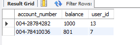

# 멱등성 테스트  (이체 API)

---

## 1. 테스트 목적

- **동시성 환경**에서 동일 요청이 여러 번 들어오더라도 **중복 처리 없이 단 1회만 거래가 발생**하도록 보장하는지 검증
- **Idempotency-Key** 기반 요청 중복 방지 로직을 검증하는 것을 목표로 한 테스트입니다.

---

## 2. 테스트 환경

- **Postman** (Pre-request Script 활용)
- Spring Boot + JPA + MySQL
- 테스트 API: `/api/accounts/transfer`
- 테스트 조건:
    - `Idempotency-Key` **모두 동일 값**
    - 동시 요청 개수: **20건**
    - 송금 금액: `5원`
    - 이체 전 각 계좌의 잔액은 각 1000원, 801원이며, 이체를 20번 하여도 5원의 입금, 출금이 1번 반영되는 것을 기대
    
    
    

---

## 3. 테스트 스크립트 (Postman Pre-request Script)

```jsx
const N = 20; // 동시 요청 수
const url = pm.environment.get('baseUrl') + '/api/accounts/transfer';
const headers = {
  'Authorization': `Bearer ${pm.environment.get('accessToken')}`,
  'Content-Type': 'application/json',
  'Idempotency-Key': pm.environment.get('IDEMPOTENCY_KEY') //지정한 멱등키 동일하게 지정};
  
const body = JSON.stringify({
  fromBankId: Number(pm.environment.get('fromBankId')),
  toBankId: Number(pm.environment.get('toBankId')),
  fromAccountNumber: pm.environment.get('fromAccountNumber'),
  toAccountNumber: pm.environment.get('toAccountNumber'),
  amount: Number(pm.environment.get('amount'))
});

let done = 0, counts = {};
for (let i = 0; i < N; i++) {
  pm.sendRequest({ url, method: 'POST', header: headers, body: { mode: 'raw', raw: body } },
    (err, res) => {
      const code = err ? 'ERR' : String(res.code);
      counts[code] = (counts[code] || 0) + 1;
      if (++done === N) {
        console.log('HTTP code counts:', counts);
        pm.test('All parallel requests finished', () => true);
      }
    });
}
setTimeout(() => { if (done < N) console.warn(`Finished ${done}/${N}`, counts); }, 25000);

```

---

## 4. 실행 결과

### (1) Postman 실행 로그

- **20건 요청 모두 200 OK 반환**
- 서버에서는 첫 번째 요청만 처리, 나머지는 동일 응답 재사용


---

### (2) DB 계좌 잔액 변화


---

### (3) 거래 내역 테이블

- **단 1건의 출금/입금 쌍만 기록되는 것을 쿼리문을 통해 확인할 수 있습니다.**
- `(requset_id,type)` unique 제약


---

## 5. 결론

- **검증 포인트**
    - 동일 `Idempotency-Key`를 가진 요청 멱등성을 보장해야하므로 단 1회의 요청만 처리
    - 이후 중복적인 요청은 DB 변경 없이 동일 결과 반환
    - 동시성 환경에서도 데이터 무결성 보장

---

## 6. 한계점 및 개선 방향

- **한계점**
    1. 테스트 환경이 **Postman 스크립트 기반**이라 실제 대규모 트래픽 환경(수백~수천 TPS)에서의 부하와 지연 시간은 측정 불가
    2. `Idempotency-Key`를 직접 지정하여 테스트
        
        → 악의적 중복 요청 방지를 위해 서버 측에서 추가적인 **만료 관리**나 **서명 검증** 필요
        
    3. **요청 Payload**에 대한 변경 탐지 로직 구현 없이 테스트
        
        → 동일 `Idempotency-Key`로 서로 다른 payload가 들어오면 식별 불가
        
- **개선 방향**
    1. 부하 테스트 도구(K6, JMeter)를 사용해 1초 수백 건 이상의 부하 환경에서도 멱등성 유지 여부 검증해보기
    2. `Idempotency-Key`와 **요청 Body 해시**를 함께 저장해 payload 변조 여부도 탐지 가능하게 개선해보기
    3. `Idempotency-Key`에 **TTL(유효기간)** 적용해 불필요한 저장소 점유 방지

---